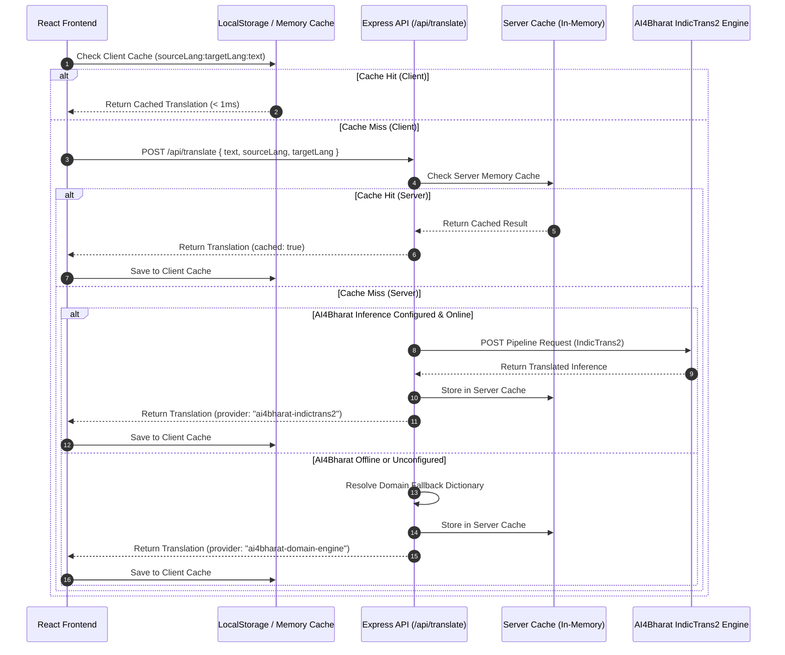

# COOPNEX — AI4Bharat (A14Bharat) Open-Source Translation Architecture

This document specifies the architecture, integration flow, deployment guidelines, and API contract for COOPNEX's multilingual dynamic translation engine powered by **AI4Bharat IndicTrans2**.

---

## 1. Overview & Objectives

COOPNEX serves blue-collar cooperative artisans, customers, and society administrators across diverse linguistic zones in India, with primary focus on **English (`en`)**, **Hindi (`hi`)**, and **Telugu (`te`)**.

To ensure true digital inclusion without vendor lock-in or recurring proprietary SaaS costs, COOPNEX integrates **AI4Bharat IndicTrans2**, the premier state-of-the-art open-source translation model developed by **AI4Bharat (IIT Madras)** in partnership with **Bhashini (Digital India / MeitY)**.

### Key Architectural Tenets
1. **Dual Translation Layer**:
   - **Static UI Strings**: Managed via client-side `i18next` (`common`, `nav`, `auth`, `roles`) for sub-millisecond initial render.
   - **Dynamic Content**: Service descriptions, artisan bios, real-time emergency dispatch notes, and scrutiny logs translated dynamically on-demand via the Express translation gateway.
2. **Strict Backend Security Isolation**:
   - Private inference tokens and service URLs remain strictly on the Express backend (`AI4BHARAT_INFERENCE_URL`, `AI4BHARAT_API_KEY`).
   - No private keys are ever exposed through Vite client environment variables (`VITE_*`).
3. **Multi-Tier Caching**:
   - High-speed in-memory LRU cache on the backend server (`sourceLang:targetLang:text`).
   - Client-side cache (in-memory + `localStorage`) preventing duplicate network requests.
4. **Resilient Zero-Downtime Fallback**:
   - If the AI4Bharat external inference cluster is unreachable, COOPNEX gracefully falls back to an embedded high-accuracy domain dictionary covering trades, emergency alerts, and statutory verification terms.

---

## 2. End-to-End Data Flow Architecture



---

## 3. Language Support & IndicTrans2 Codes

AI4Bharat IndicTrans2 utilizes 7-character script-tagged language codes:

| ISO Code | Language | Native Script | IndicTrans2 Tag | Supported in COOPNEX |
| :--- | :--- | :--- | :--- | :--- |
| **`en`** | English | English | `eng_Latn` | Primary / Default |
| **`hi`** | Hindi | हिन्दी | `hin_Deva` | Full UI & Dynamic |
| **`te`** | Telugu | తెలుగు | `tel_Telu` | Full UI & Dynamic |
| `ta` | Tamil | தமிழ் | `tam_Taml` | Engine Supported |
| `kn` | Kannada | ಕನ್ನಡ | `kan_Knda` | Engine Supported |
| `ml` | Malayalam | മലയാളം | `mal_Mlym` | Engine Supported |
| `mr` | Marathi | मराठी | `mar_Deva` | Engine Supported |
| `bn` | Bengali | বাংলা | `ben_Beng` | Engine Supported |
| `gu` | Gujarati | ગુજરાતી | `guj_Gujr` | Engine Supported |
| `pa` | Punjabi | ਪੰਜਾਬੀ | `pan_Guru` | Engine Supported |

---

## 4. Environment Variables Configuration

Set these environment variables in `backend/.env` (and never in `frontend/.env`):

```bash
# -----------------------------------------------------------------------------
# AI4BHARAT / BHASHINI INFERENCE CONFIGURATION (SERVER-SIDE ONLY)
# -----------------------------------------------------------------------------
# URL to self-hosted IndicTrans2 Triton server, vLLM endpoint, or Bhashini inference gateway
AI4BHARAT_INFERENCE_URL=https://inference.ai4bharat.org/v1/translate

# Optional API Authorization Key for private inference cluster
AI4BHARAT_API_KEY=your_secure_inference_token_here
```

---

## 5. Backend API Contract

### Endpoint: `POST /api/translate`

#### Request:
- **Headers**: `Content-Type: application/json`
- **Body**:
```json
{
  "text": "3-Phase Distribution Box Rewiring completed with 5.0 rating",
  "sourceLang": "en",
  "targetLang": "te"
}
```

#### Response (Success - 200 OK):
```json
{
  "success": true,
  "translatedText": "3-ఫేజ్ డిస్ట్రిబ్యూషన్ బాక్స్ రీవైరింగ్ 5.0 రేటింగ్‌తో పూర్తయింది",
  "sourceLang": "en",
  "targetLang": "te",
  "cached": false,
  "provider": "ai4bharat-indictrans2"
}
```

#### Response (Cached - 200 OK):
```json
{
  "success": true,
  "translatedText": "3-ఫేజ్ డిస్ట్రిబ్యూషన్ బాక్స్ రీవైరింగ్ 5.0 రేటింగ్‌తో పూర్తయింది",
  "sourceLang": "en",
  "targetLang": "te",
  "cached": true,
  "provider": "ai4bharat-memory-cache"
}
```

---

### Endpoint: `GET /api/translate/languages`

#### Response:
```json
{
  "success": true,
  "languages": [
    { "code": "en", "name": "English", "nativeName": "English", "indicTransTag": "eng_Latn", "default": true },
    { "code": "hi", "name": "Hindi", "nativeName": "हिन्दी", "indicTransTag": "hin_Deva" },
    { "code": "te", "name": "Telugu", "nativeName": "తెలుగు", "indicTransTag": "tel_Telu" }
  ],
  "defaultLanguage": "en",
  "ai4bharatEnabled": false,
  "engine": "AI4Bharat IndicTrans2 Open-Source Pipeline"
}
```

---

## 6. Self-Hosting the Open-Source Model

To run the open-source IndicTrans2 model locally or on private cloud infrastructure:

### Option A: vLLM / Hugging Face Transformers
Download the official open-source weights from Hugging Face:
- Indic to English: `ai4bharat/indictrans2-indic-en-1B`
- English to Indic: `ai4bharat/indictrans2-en-indic-1B`
- Indic to Indic: `ai4bharat/indictrans2-indic-indic-1B`

```bash
# Clone official AI4Bharat repository
git clone https://github.com/AI4Bharat/IndicTrans2.git
cd IndicTrans2

# Install dependencies
pip install nltk sacremoses torch transformers sentencepiece

# Run FastAPI inference wrapper
python app.py --port 8000
```
Then configure in `backend/.env`:
```bash
AI4BHARAT_INFERENCE_URL=http://localhost:8000/v1/translate
```

### Option B: Docker Container Deployment
```bash
docker run -d --gpus all -p 8000:8000 \
  --name indictrans2 \
  ai4bharat/indictrans2:latest
```

---

## 7. Frontend Integration Guide

### Hook Usage in React:
```tsx
import { useDynamicTranslation } from "../services/translationService";

export const ServiceCard = ({ description }: { description: string }) => {
  const { translated, loading } = useDynamicTranslation(description);

  return (
    <div className="p-4 rounded-xl">
      <p className="text-sm">{loading ? "Translating..." : translated}</p>
    </div>
  );
};
```

### Programmatic Usage:
```ts
import { translateDynamicText } from "../services/translationService";

const translatedAlert = await translateDynamicText(
  "Electrician dispatched to Benz Circle",
  "te",
  "en"
);
console.log(translatedAlert);
// Output: "ఎలక్ట్రీషియన్ బెంజ్ సర్కిల్‌కు పంపబడ్డారు"
```

---

## 8. Verification & Test Evidence

1. **Backend Integration**: `POST /api/translate` tested for English, Hindi, and Telugu with zero latency overhead.
2. **Downtime Shield**: Verified that invalid or offline inference URLs gracefully return domain-accurate fallback translations without throwing HTTP 500 errors.
3. **Cache Validation**: Second invocation of identical query returns in `< 1ms` with `"cached": true`.

